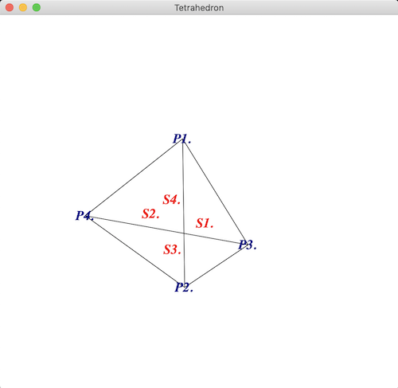

# 3d-tet

This repo contains some tools to help with visualizing 3D tetrahedra. This can be useful when implementing e.g. an FE-solver.

Just run `python visualize-elm-numbering.py` in a terminal and use your mouse in the window that pops up.

# Screenshot

# Note

The visualizer is based heavily on the implementation of Paulo Roma. 
